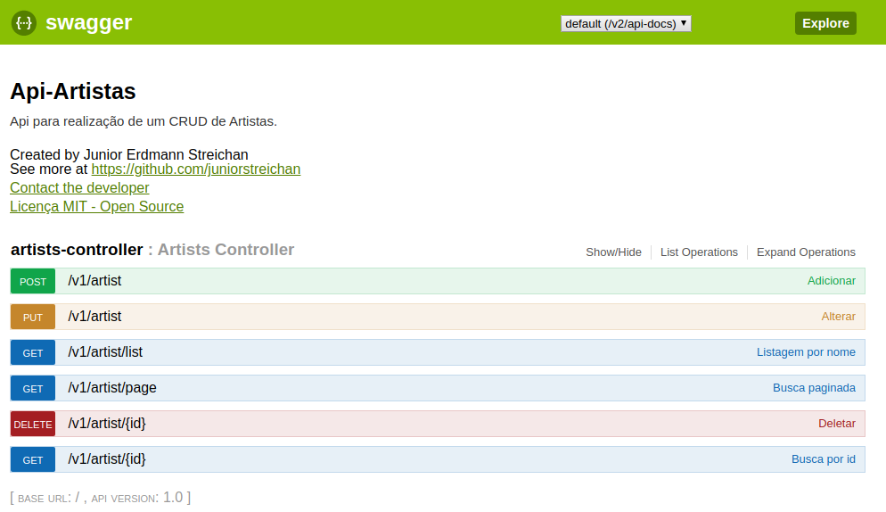

# Uma REST API para gerenciamento de artistas 


### Arquitetura
- [**Java 11**](https://www.edivaldobrito.com.br/oracle-java-11-no-ubuntu/) 
- Apache Maven
- Spring Boot 2.2
- Spring Data JPA
- Postgres
- Metodologia TDD

### Ferramentas
- IntelliJ
- DBeaver
- Insomnia

### [Script SQL](./scripts)


### Ambiente DEV
- [Arquivo de configuração](./api/src/main/resources/application-dev.properties)

### Ambiente PROD
- [Arquivo de configuração](./api/src/main/resources/application-prod.properties)

```$xslt
é preciso configurar as variáveis de ambiente:
API_DB_URL
API_DB_USERNAME
API_DB_PASSWORD
para conectar no banco de dados
```
-  Para gerar o build de produção:
```shell script
mvn -Dspring.profiles.active=prod  clean package 
```
o arquivo .jar estará na pasta `./api/target/api.jar` <br />
e finalmente é só rodar:
```shell script
java -jar -Dspring.profiles.active=prod  ./api/target/api.jar
```
Não esqueça que a versão do java é a 11 !
### Swagger
> Para ver a documentação da api acesse HOST/swagger-ui.html

### Veja como foi a organização do desenvolvimento da solução nessa [board](https://github.com/juniorstreichan/artists-api/projects/1)


### Referências e Guias do Spring
* [Official Apache Maven documentation](https://maven.apache.org/guides/index.html)
* [Spring Boot Maven Plugin Reference Guide](https://docs.spring.io/spring-boot/docs/2.2.0.RELEASE/maven-plugin/)
* [Spring Boot DevTools](https://docs.spring.io/spring-boot/docs/2.2.0.RELEASE/reference/htmlsingle/#using-boot-devtools)
* [Spring Web](https://docs.spring.io/spring-boot/docs/2.2.0.RELEASE/reference/htmlsingle/#boot-features-developing-web-applications)
* [Spring Data JPA](https://docs.spring.io/spring-boot/docs/2.2.0.RELEASE/reference/htmlsingle/#boot-features-jpa-and-spring-data)


* [Building a RESTful Web Service](https://spring.io/guides/gs/rest-service/)
* [Serving Web Content with Spring MVC](https://spring.io/guides/gs/serving-web-content/)
* [Building REST services with Spring](https://spring.io/guides/tutorials/bookmarks/)
* [Accessing Data with JPA](https://spring.io/guides/gs/accessing-data-jpa/)

